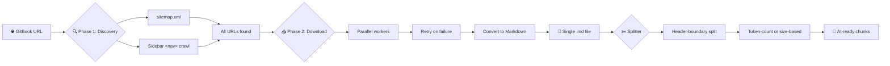

<p align="center">
  
  
  
  
  <a href="https://pypi.org/project/gitbook-downloader/"></a>
</p>

<h1 align="center">⬡ GitBook Downloader</h1>

<p align="center">
  <strong>Download entire GitBook documentation sites → single markdown file → AI-ready chunks.</strong><br>
  Built for developers who feed docs to LLMs. Saves tokens. Saves time.
</p>

---

## 💡 Why This Exists

You found a great documentation site on GitBook. You want to:

1. **Read it offline** — no internet, no rate limits, instant search
2. **Feed it to an AI** — ChatGPT, Claude, Gemini, local LLMs — but the context window is limited
3. **Split it smartly** — break into chunks that each fit within token limits, without cutting mid-paragraph

**That's exactly what this tool does.** Two steps, zero hassle.

```bash
# Step 1: Download the entire site
gitbook-dl download https://docs.mysite.com/

# Step 2: Split into AI-friendly chunks
gitbook-dl split downloaded_docs.md --max-tokens 8000
```

---

## ✨ Features

<table>
<tr>
<td width="50%">

### 🔍 Smart Discovery
- Recursive sitemap parsing (handles sitemap indexes)
- Sidebar navigation crawling for complete coverage
- Finds pages that sitemaps miss
- Saturation detection — stops when all pages found

</td>
<td width="50%">

### 📥 Robust Downloads
- Parallel downloads (1–10 concurrent workers)
- Retries with exponential backoff (1s → 3s → 8s)
- Rate-limit handling (429 auto-wait)
- Failed page tracking + `_failed.json` output
- Page-size tracking in real-time

</td>
</tr>
<tr>
<td width="50%">

### ✂️ AI-Optimized Splitter
- Header-boundary aware (never cuts mid-section)
- Token-count splitting (via `tiktoken` — Claude/GPT encoding)
- Byte-size splitting as fallback
- Zero-config: detects the best strategy

</td>
<td width="50%">

### 🖥️ Beautiful GUI
- Linear-inspired dark theme
- Live stats: Discovered, Downloaded, Failed, Elapsed
- Real-time progress bar + activity log
- Two tabs: Download & Split
- Built with `customtkinter`

</td>
</tr>
</table>

---

## 🚀 Quickstart

### Prerequisites

- **Python 3.8+**
- **pip** (comes with Python)

### Install

```bash
# Option 1: Install from PyPI (coming soon)
pip install gitbook-downloader

# Option 2: Install from GitHub
pip install git+https://github.com/RohannShetty/gitbook-downloader.git

# Option 3: Clone and install locally
git clone https://github.com/RohannShetty/gitbook-downloader.git
cd gitbook-downloader
pip install -e .
```

### Want the GUI?

```bash
pip install gitbook-downloader[gui]
```

### Want token-aware splitting?

```bash
pip install gitbook-downloader[tokens]
```

### Or everything:

```bash
pip install gitbook-downloader[all]
```

---

## 📖 Usage

### CLI Mode

```bash
# ── Download ──────────────────────────────────────
gitbook-dl download https://docs.example.com/
gitbook-dl download https://docs.example.com/ -o mydocs.md
gitbook-dl download https://docs.example.com/ -p 1000 -w 8

# ── Split ─────────────────────────────────────────
gitbook-dl split downloaded_docs.md
gitbook-dl split downloaded_docs.md -s 2.0           # 2 MB chunks
gitbook-dl split downloaded_docs.md -t 8000           # 8K token chunks
gitbook-dl split downloaded_docs.md -o ./my_chunks/   # custom output dir

# ── GUI ───────────────────────────────────────────
gitbook-dl gui
```

### CLI Options — `download`

| Flag | Description | Default |
|------|-------------|---------|
| `url` | GitBook site URL | *(required)* |
| `-o, --output` | Output markdown file | `downloaded_docs.md` |
| `-p, --max-pages` | Maximum pages to download | `5000` |
| `-w, --workers` | Parallel download workers (1–10) | `5` |

### CLI Options — `split`

| Flag | Description | Default |
|------|-------------|---------|
| `file` | Input markdown file | *(required)* |
| `-o, --output-dir` | Output directory for chunks | `<file>_chunks/` |
| `-s, --max-mb` | Max MB per chunk | `1.0` |
| `-t, --max-tokens` | Max tokens per chunk *(overrides -s)* | `0` (disabled) |

### GUI Mode

```bash
gitbook-dl gui
```

<p align="center">
  <em>Linear-inspired dark dashboard with live stats, progress bar, and activity log.</em>
</p>

---

## 🧠 How It Works



### Phase 1 — Discovery

1. **Sitemap parsing** — Recursively fetches `sitemap.xml`, handles sitemap indexes, extracts all canonical URLs
2. **Sidebar crawling** — Crawls `<nav>` elements on GitBook pages to find pages the sitemap might miss
3. **Saturation detection** — Stops when no new links are found for 5 consecutive pages

### Phase 2 — Download

1. **Parallel workers** — Downloads pages concurrently with configurable threads
2. **Retry logic** — 3 attempts with exponential backoff for transient failures
3. **Content extraction** — Strips navigation, footers, sidebars, scripts; preserves main content
4. **Markdown conversion** — HTML → clean markdown with ATX headers

### Splitter

1. **Header-boundary awareness** — Splits on `#` headers so chunks never break mid-section
2. **Token counting** — Uses `tiktoken` (GPT-4/Claude encoding) when available
3. **Byte-size fallback** — Falls back to MB-based splitting without `tiktoken`

---

## 🎯 Use Cases

### 1. Feed documentation to ChatGPT / Claude

```bash
gitbook-dl download https://docs.langchain.com/
gitbook-dl split downloaded_docs.md -t 6000
# → Upload chunks to ChatGPT as knowledge files
```

### 2. Local RAG (Retrieval-Augmented Generation)

```bash
gitbook-dl download https://docs.example.com/ -o knowledge_base.md
gitbook-dl split knowledge_base.md -s 0.5
# → Index chunks in your vector database
```

### 3. Offline documentation archive

```bash
gitbook-dl download https://docs.example.com/
# → Single .md file — searchable, portable, version-controllable
```

### 4. Fine-tuning dataset preparation

```bash
gitbook-dl download https://docs.framework.com/ -o training.md
gitbook-dl split training.md -t 2048
# → Clean, sectioned chunks for fine-tuning
```

---

## 🏗️ Project Structure

```
gitbook-downloader/
├── src/
│   └── gitbook_downloader/
│       ├── __init__.py          # Package metadata
│       ├── __main__.py          # python -m entry point
│       ├── engine.py            # SmartEngine — discovery + download
│       ├── splitter.py          # AI-optimized markdown splitter
│       ├── cli.py               # CLI with argparse (download/split/gui)
│       └── dashboard.py         # Linear-inspired dark GUI
├── pyproject.toml               # Package config + dependencies
├── requirements.txt             # Plain pip dependencies
├── LICENSE                      # MIT
├── CHANGELOG.md                 # Release history
├── CONTRIBUTING.md              # How to contribute
└── README.md                    # You're reading it!
```

---

## 🤝 Contributing

Contributions are welcome! Here's how:

1. **Found a bug?** [Open an issue](https://github.com/RohannShetty/gitbook-downloader/issues)
2. **Want a feature?** [Start a discussion](https://github.com/RohannShetty/gitbook-downloader/discussions)
3. **Want to code?** See [CONTRIBUTING.md](CONTRIBUTING.md)

### Ideas for Contributors

- [ ] Support for non-GitBook documentation platforms (Docusaurus, ReadTheDocs, MkDocs)
- [ ] Resume interrupted downloads
- [ ] Custom headers/cookies for authenticated sites
- [ ] PDF output option
- [ ] Docker image
- [ ] GitHub Actions for scheduled doc downloads
- [ ] Better image handling (download + embed)
- [ ] Search index generation
- [ ] Multi-site batch downloads
- [ ] Web UI (Flask/FastAPI)

---

## 📝 Changelog

See [CHANGELOG.md](CHANGELOG.md) for the full release history.

### Recent

- **v3.1** — Clean package structure, CLI with argparse, token-aware splitting, public release
- **v3.0** — Sitemap recursion, sidebar crawling, proper content extraction
- **v2.0** — Two-phase engine, parallel downloads, retry logic, live stats
- **v1.0** — Initial dashboard with Download + Split tabs

---

## ⚠️ Important Notes

- **Respect robots.txt** — This tool crawls responsibly but you should check the site's terms
- **Rate limiting** — The engine handles HTTP 429 automatically with exponential backoff
- **Large sites** — Sites with 1000+ pages may take several minutes to download
- **Authentication** — Currently only works with public GitBook sites (PRs welcome for auth support)
- **Memory usage** — Very large documentation sites (5000+ pages) may use significant RAM

---

## 💬 Community

- **Issues**: [github.com/RohannShetty/gitbook-downloader/issues](https://github.com/RohannShetty/gitbook-downloader/issues)
- **Discussions**: [github.com/RohannShetty/gitbook-downloader/discussions](https://github.com/RohannShetty/gitbook-downloader/discussions)

---

## 📄 License

MIT © [Rohan Shetty](https://github.com/RohannShetty)

---

<p align="center">
  <sub>Built with ❤️ to make AI-assisted development easier. Star the repo if it helped you!</sub>
</p>
