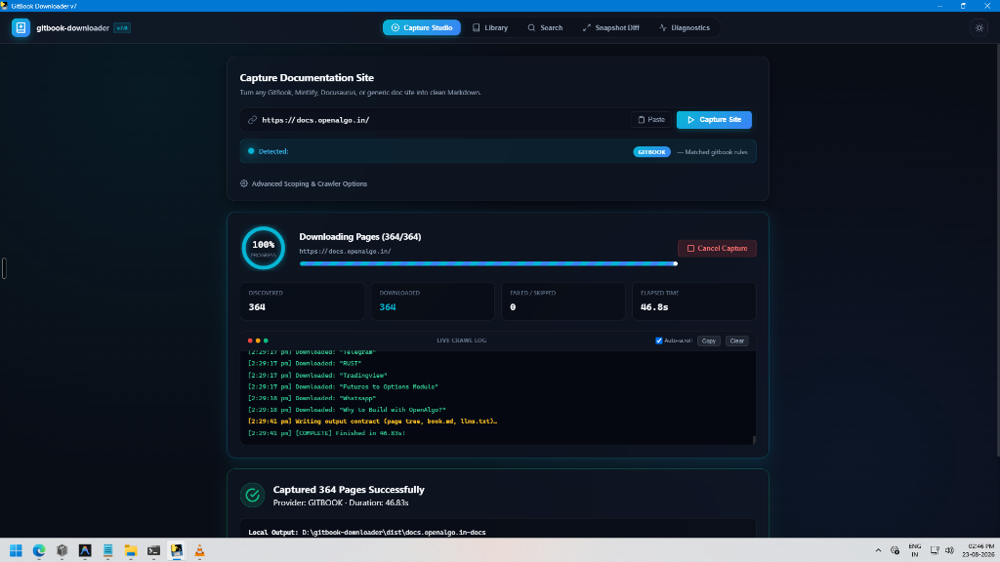
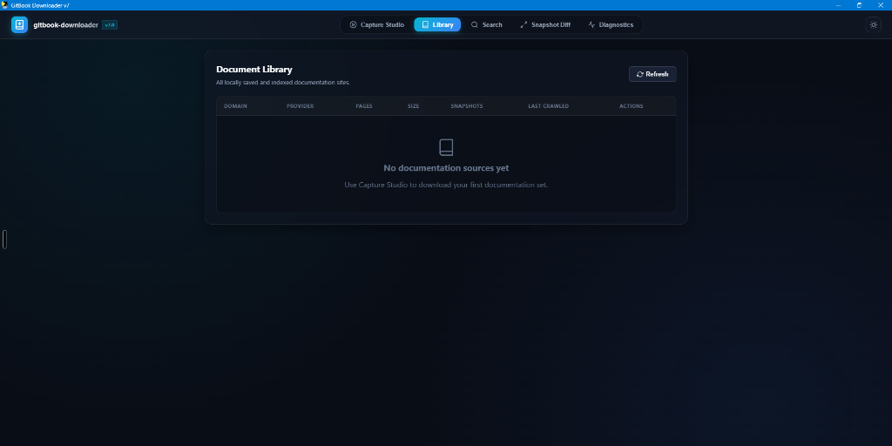

<div align="center">


# DocHarvest

### Turn Any Documentation Site into LLM-Ready Markdown, Vector Context & Offline Books

**Zero-Config CLI · React Desktop GUI · Native FastMCP Server · Pure-Python PDF Studio**

[](CHANGELOG.md)
[](LICENSE)
[](pyproject.toml)
[](https://ui.shadcn.com)
[](#-ai-agent-integration-native-fastmcp-server)
[](CHANGELOG.md)
[](#)
[](https://pypi.org/project/gitbook-downloader/)
[](https://rohannshetty.github.io/gitbook-downloader/)

<br />



</div>

---

## ⚡ Overview

**DocHarvest** (package: `gitbook-downloader`) is a high-performance, local-first documentation compiler and AI context platform. It automatically detects documentation platforms, bounds crawls strictly to documentation subpaths, extracts clean markdown via direct `.md` endpoint probing and AST-based DOM cleaning, and compiles structured output corpora.

Whether you are feeding 500-page API manuals to **Cursor / Claude Code**, building vector RAG pipelines with **LangChain & LlamaIndex**, reading offline on an airplane, or archiving technical libraries, DocHarvest delivers a deterministic, noise-free knowledge corpus in seconds.

---

## 🧩 Supported Documentation Platforms (8 Real Providers)

DocHarvest features dedicated, priority-ordered parsers that extract clean article content and strip headers, footers, sidebars, anchor hashes, and cookie banners:

| Provider | Priority | Discovery Method | Clean Content Target |
| :--- | :---: | :--- | :--- |
| **GitBook** | `100` | `.md` endpoint probing, sitemap, space discovery | Native markdown or `.page-inner` / `article` |
| **Mintlify** | `90` | `mintlify.json`, OpenAPI specs, CDN asset anchors | `#content`, `#main-content`, `article` |
| **Docusaurus** | `80` | `sitemap.xml`, `docusaurus.config.js`, sidebars | `article`, `.markdown`, `main .theme-doc-markdown` |
| **Nextra** | `75` | `sitemap.xml`, Next.js app routes, nextra scripts | `main.nextra-content`, `article` |
| **VitePress** | `72` | Sitemap, VitePress theme anchors, route index | `div.vp-doc`, `div.VPContent`, `main.VPDoc` |
| **MkDocs** | `70` | `search/search_index.json`, sitemap | `article.md-content__inner`, `div.md-typeset` |
| **ReadMe.io** | `65` | `sitemap.xml`, `/llms.txt`, developer hub routes | `div.rm-Article`, `div.rm-Markdown`, `#content` |
| **ReadTheDocs** | `60` | Sphinx `sitemap.xml`, `div.sphinxsidebar` | `div.document[role="main"]`, `div.body` |
| **Generic HTML / SPA** | `0` | BFS link crawl, `llms.txt`, `sitemap.xml` | `main`, `article`, `[role="main"]`, `#content` |

> [!TIP]
> **Dynamic JavaScript SPAs**: If a site is rendered entirely client-side via JavaScript (such as `omp.sh/docs`), install the optional Playwright extra (`pip install "gitbook-downloader[render]" && playwright install chromium`) and run with `--render` to execute JavaScript before extracting markdown.

---

## 🌟 Key Capabilities

- 🤖 **Zero-Noise LLM Context**: Probes native `.md` endpoints and cleans DOM trees, eliminating up to 89% of token-wasting navigation boilerplate, scripts, and cookie banners.
- 📦 **Four-Part Output Contract**: Every capture generates a modular `pages/` tree with YAML frontmatter, a consolidated `book.md` with TOC, a standardized `llms.txt` manifest, and search index records.
- 🚀 **AI Export Studio**: Export to **RAG JSONL** (for vector databases), **Pure-Python PDF** (syntax-highlighted printable handbooks via `fpdf2`), and **AST Markdown chunks**.
- 🔌 **Native FastMCP Server**: Built-in Model Context Protocol server exposing 8 tools compatible with Cursor, Claude Code, Windsurf, VS Code, and 10+ other harnesses.
- 🎨 **Modern Desktop GUI**: React + Tailwind CSS + shadcn/ui desktop application featuring real-time radial progress, in-app doc reader, document library renaming, and batch queues.
- 🔍 **SQLite FTS5 Full-Text Search**: Embedded BM25 search engine with `porter unicode61` stemming across all downloaded documentation.
- 🔒 **Process-Safe Storage & Diffs**: Active PID-validated `DomainLock`, atomic file staging (`os.replace` + `os.fsync`), and semver snapshot version diffing.
- 🛡️ **100% Local, Private & Free**: Zero cloud API fees, zero telemetry, air-gap ready, and MIT-licensed.

---

## 🖥️ Desktop GUI: Document Library & Management

<div align="center">
  
</div>

The desktop application includes a dedicated **Document Library** for managing all harvested technical docs:
- **Instant Search**: Real-time filtering across downloaded portals.
- **In-App Renaming**: Organize project labels without breaking file paths.
- **1-Click Export Studio**: Export selected docsets to Markdown, Vector JSONL, or PDF handbooks directly from the GUI.
- **Direct Finder/Explorer Integration**: Open raw markdown source folders with a single click.

---

## 📋 The Four-Part Output Contract

Every crawl produces a standardized, deterministic directory structure:

```
data/
└── docs.openalgo.in/
    ├── pages/                     # Modular individual markdown files
    │   ├── 001_quickstart.md
    │   └── 002_api_reference.md
    ├── book.md                    # Consolidated single handbook with hierarchical TOC
    ├── llms.txt                   # Standardized AI discovery manifest
    ├── exports/
    │   ├── openalgo_rag.jsonl     # Tokenized vector chunks + metadata
    │   └── openalgo_handbook.pdf  # Publication-grade printable PDF (pure Python)
    └── .manifest.json             # Crawl metadata, engine version & cryptographic hashes
```

---

## 🚀 Quick Start

### Option 1: Standalone Executable (Zero Setup)
Download **[`docharvest-windows-latest.exe`](https://github.com/RohannShetty/gitbook-downloader/releases/latest)** from the latest release:
- **Double-click** to launch the **Desktop GUI Application**.
- Or execute directly in your terminal:
  ```powershell
  .\docharvest-windows-latest.exe crawl https://docs.openalgo.in/ --rag --pdf
  ```

### Option 2: Install via pip / PyPI
```bash
# Standard installation (100% local, zero C-dependencies)
pip install gitbook-downloader

# Optional headless browser rendering for dynamic JavaScript SPAs
pip install "gitbook-downloader[render]"
playwright install chromium

# Optional FastMCP server support
pip install "gitbook-downloader[mcp]"

# Launch desktop GUI:
docharvest --gui

# Or run a CLI crawl:
docharvest capture https://docs.openalgo.in/ --rag --pdf
```

### Option 3: Ultra-Fast One-Liner via uv / uvx
```bash
# Launch GUI instantly without permanent installation:
uvx gitbook-downloader --gui

# Or install as a global CLI tool:
uv tool install gitbook-downloader
```

---

## 💻 CLI Command Reference

```bash
# Basic Documentation Crawl (aliases: capture, dl, crawl)
# `docharvest capture` is the canonical verb; `crawl` remains as a documented alias.
docharvest capture https://docs.openalgo.in/

# Full Compilation (Markdown + RAG JSONL + llms.txt + PDF Handbook)
docharvest capture https://docs.openalgo.in/ --rag --pdf

# Crawl Dynamic Client-Rendered SPAs (Playwright Headless Browser)
docharvest capture https://omp.sh/docs --render

# Restrict Crawl to Specific Path Prefix & Limit Depth
docharvest capture https://docs.example.com/ --scope /api/ --max-pages 50

# Full-Text BM25 Search across Harvested Docs
docharvest search "OAuth 2.0 authentication token"

# List Harvested Document Domains in Local Library
docharvest ls

# Show Snapshot History & Diff Versions
docharvest history docs.example.com
docharvest diff docs.example.com snap-20260822 snap-20260828

# Start FastMCP Server over Stdio for AI IDEs
docharvest --mcp

# Launch Desktop GUI Application
docharvest --gui
```

---

## 🔌 AI Agent Integration: Native FastMCP v2 Server

DocHarvest includes a native **FastMCP (Model Context Protocol v2)** server that exposes 10 high-level tools, **MCP Resources**, and **MCP Prompts** over standard input/output (`stdio`). It is compatible with both `mcp<2` and `mcp>=2.1`.

### All 10 Native MCP Tools

1. `download_docs(url, max_pages=None, workers=8, path_scope=[], exclude_paths=[], site_versions=None, output_mode="both")`
   Captures any documentation URL into Markdown, `book.md`, and `llms.txt`.
2. `search_docs(query, domain=None, limit=10)`
   Full-text search across downloaded documentation via SQLite FTS5 BM25.
3. `query_doc_graph(domain, query, limit=10)`
   Queries the semantic entity & concept graph to discover connected API endpoints and sections without reading full files.
4. `get_related_concepts(domain, concept)`
   Returns 1-hop and 2-hop connected concepts and prerequisite sections.
5. `list_domains()`
   Returns metadata for all harvested documentation portals in local storage.
6. `get_doc(domain, version=None)`
   Retrieves the compiled documentation content or preview for a domain.
7. `diff_versions(domain, v1, v2)`
   Computes unified diffs and line change statistics between two snapshots.
8. `list_versions(domain)`
   Lists available captured snapshots and timestamps for a domain.
9. `export_docs(domain, format="markdown")`
   Exports documentation into `"markdown"`, `"jsonl"`, or `"rag"` metadata formats.
10. `get_changelog(domain)`
    Auto-generates version changelogs across captured snapshot iterations.

### MCP v2 Resources & Prompts
- **Resources**: `docs://{domain}/book` (full handbook), `docs://{domain}/manifest` (`llms.txt` index).
- **Prompts**: `prompt://search-docset` (guided docset synthesis), `prompt://summarize-library` (library overview).

---

### IDE & Agent Configuration Matrix (14 Clients)

#### 1. Claude Code
```bash
claude mcp add docharvest docharvest mcp
```
Or in `~/.claude.json`:
```json
{
  "mcpServers": {
    "docharvest": {
      "command": "docharvest",
      "args": ["mcp"]
    }
  }
}
```

#### 2. Claude Desktop (`claude_desktop_config.json`)
```json
{
  "mcpServers": {
    "docharvest": {
      "command": "uvx",
      "args": ["gitbook-downloader", "mcp"]
    }
  }
}
```

#### 3. Cursor (`.cursor/mcp.json`)
```json
{
  "mcpServers": {
    "docharvest": {
      "command": "python",
      "args": ["-m", "gitbook_downloader.mcp"]
    }
  }
}
```

#### 4. Windsurf (`~/.codeium/windsurf/mcp_config.json`)
```json
{
  "mcpServers": {
    "docharvest": {
      "command": "docharvest",
      "args": ["mcp"]
    }
  }
}
```

#### 5. VS Code (`.vscode/mcp.json`)
```json
{
  "servers": {
    "docharvest": {
      "type": "stdio",
      "command": "docharvest",
      "args": ["mcp"]
    }
  }
}
```

#### 6. JetBrains AI Assistant / PyCharm / IntelliJ
Configure via **Settings → Tools → Model Context Protocol (MCP)**:
- **Server Name**: `docharvest`
- **Command**: `docharvest`
- **Arguments**: `mcp`

#### 7. Zed (`settings.json`)
```json
{
  "context_servers": {
    "docharvest": {
      "command": "docharvest",
      "args": ["mcp"]
    }
  }
}
```

#### 8. Cline (`cline_mcp_settings.json`)
```json
{
  "mcpServers": {
    "docharvest": {
      "command": "docharvest",
      "args": ["mcp"],
      "disabled": false,
      "autoApprove": ["search_docs", "get_doc", "list_domains", "query_doc_graph"]
    }
  }
}
```

#### 9. Continue.dev (`config.json`)
```json
{
  "experimental": {
    "modelContextProtocolServers": [
      {
        "transport": {
          "type": "stdio",
          "command": "docharvest",
          "args": ["mcp"]
        }
      }
    ]
  }
}
```

#### 10. Kiro (`.kiro/settings/mcp.json`)
```json
{
  "mcp": {
    "servers": {
      "docharvest": {
        "command": "docharvest",
        "args": ["mcp"]
      }
    }
  }
}
```

#### 11. OpenCode (`opencode.json`)
```json
{
  "mcp": {
    "docharvest": {
      "command": "docharvest",
      "args": ["mcp"]
    }
  }
}
```

#### 12. Pi (`pi.dev`) / Oh My Pi (`omp.sh`) (`~/.omp/config.json`)
```json
{
  "mcp_servers": {
    "docharvest": {
      "command": "docharvest",
      "args": ["mcp"]
    }
  }
}
```

#### 13. Antigravity / Gemini CLI (`mcp/docharvest.json`)
```json
{
  "name": "docharvest",
  "command": "docharvest",
  "args": ["mcp"]
}
```

#### 14. OpenAI Codex CLI (`codex_config.json`)
```json
{
  "mcp_servers": {
    "docharvest": {
      "command": "docharvest",
      "args": ["mcp"]
    }
  }
}
```

---

## 🐍 Python SDK Example

```python
from gitbook_downloader.api import capture, CaptureOptions

# Configure capture options
options = CaptureOptions(
    workers=8,
    output_mode="both",   # "both", "library", or "local"
    render=False,         # set True for dynamic JavaScript SPAs
)

# Execute deterministic capture
result = capture("https://docs.openalgo.in/", options=options)

print(f"Captured {result.pages_captured} pages using provider: {result.provider}")
print(f"Book file: {result.book_file}")
print(f"Manifest:  {result.manifest_file}")
```

---

## 🧪 Test Suite & Quality Benchmarks

DocHarvest is continuously tested across Windows, Linux, and macOS:

- **531 Automated Tests**: 100% test pass rate across engine discovery, BFS crawling, provider extraction, storage safety, DocGraph semantic search, and MCP v2 tools.
- **73%+ Statement Coverage**: Rigorous test suites covering error recovery, invalid signatures, domain locks, and AST link normalization.
- **Windows CRLF Safe**: All link and boilerplate stripping routines are cross-platform normalized against Windows CRLF and Unix LF linebreaks.

To run the test suite locally:
```bash
uv run pytest --cov=gitbook_downloader
```

---

## 👨‍💻 Author & Connect

Created with ❤️ by **Rohan Shetty**.

- 🌐 **Website**: [rohannshetty.github.io/gitbook-downloader](https://rohannshetty.github.io/gitbook-downloader/)
- 🐙 **GitHub**: [@RohannShetty](https://github.com/RohannShetty)
- 💼 **LinkedIn**: [linkedin.com/in/rohan-shettyy](https://www.linkedin.com/in/rohan-shettyy/)
- 🐦 **X (Twitter)**: [@rohan__shetty](https://x.com/rohan__shetty)
- 📧 **Email**: [shettyrohan2@gmail.com](mailto:shettyrohan2@gmail.com)

---

## 📄 License

This project is licensed under the [MIT License](LICENSE).
